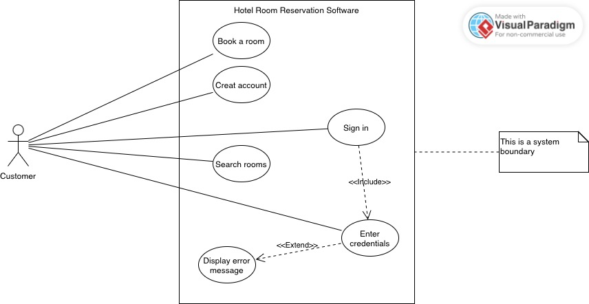

Team: Exchange student
2601764 Seungheon Sa
2601783 WASIER Marin
2601760 Hein, Patrick

1: 
Owner : beneficial, application works, security, accesability
Receptionist: reservation, payment, identification,
Service custom: room (empty or full)
Users : make resevation, details of the room, security app, contact (service)

2:
-The application needs to show every room with their details. Have the posibility to reserve the room and them pay for it. sign in/ sign up function Service custom needs to know wich room to clean. 
For the receptionist needs to know the identification and payment are correct. Create diferent pages for diferentes level of admin. 
The website needs to be quicly and update for other users if the room is booked or no. 
The ebsite needs to be reliable and in case of failures we will write our service contact: Automatic monitoring service.
Secure the id and password of users and the payment detail. Make sure that the reversation can't be change bby normal users.
Employes should modify and extend reservations and room details. Change website's infos. 
Payment service
If the dates of reservations are not good, we need to block that access.

3:

